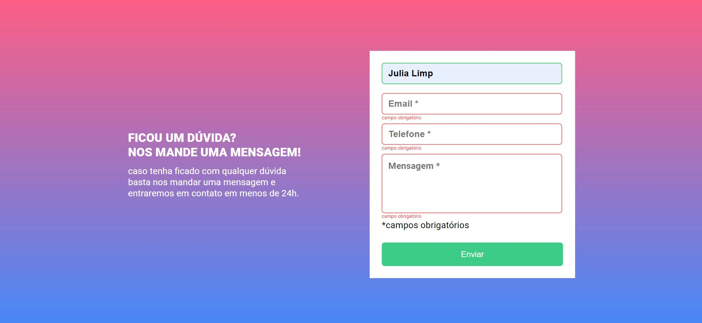

# Form Validation - DevQuest HTML, CSS and JavaScript

This is a solution to the [DevQuest Challenge](https://www.figma.com/file/zBKnYG9UNdUiIr8ClQTWSG/DESAFIO---HTML%2FCSS%2FJS-INTERMEDI%C3%81RIO?node-id=3-2&t=DjsGbu8PKGSNuUGD-0).

## Table of contents

- [Overview](#overview)
  - [The challenge](#the-challenge)
  - [Screenshot](#screenshot)
  - [Links](#links)
- [My process](#my-process)
  - [Built with](#built-with)
  - [What I learned](#what-i-learned)
  - [Continued development](#continued-development)
- [Author](#author)

## Overview

### The challenge

Users should be able to:

- View the optimal layout for the page depending on their device's screen size
- See hover states for submit button
- Validate if the input is filled or not

### Screenshot
#### Desktop

#### Mobile

#### Submit

### Links

- Solution URL: [Solution URL - Repository](https://github.com/julialimp/quest-html-css-javascript-intermediario)
- Live Site URL: [GitHub Pages](https://julialimp.github.io/quest-html-css-javascript-intermediario)

## My process

### Built with

- Semantic HTML5 markup
- CSS custom properties
- Flexbox
- JS functions
- forEach method

### What I learned

The difficulty I had here was to select both input and required text related to each input individually. At first, whether the red text appeared under all the inputs or none. At least, I could finnally realise I had to use `const[index].classList` and everything worked out as it should

### Continued development

I'm looking forward to practicing some more JavaScript properties. Comparing to my last project, I already felt more easiness working with HTML and CSS properties, which means I can feel my improvement.

## Author

- Linkedin - [Juia Limp](https://www.linkedin.com/in/julia-limp-de-almeida-675953121?lipi=urn%3Ali%3Apage%3Ad_flagship3_profile_view_base_contact_details%3BZJi4VgNnTlSIG5FKPrpXAg%3D%3D)
- Instagram - [@julialimp](https://www.instagram.com/julialimp)
- GitHub - [@julialimp](https://github.com/julialimp)

